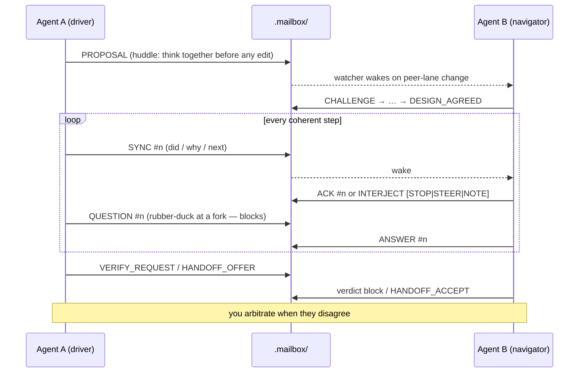

<p align="center">
  
</p>

**Run two GitHub Copilot CLI instances side by side — different models, one repo, working as peers.**

Two senior engineers at the same desk: they think together in a design huddle before any code is written, then one drives while the other navigates — step-by-step syncs, live interjections, rubber-duck questions — through a tiny file-based mailbox with one write-lane per agent. Ownership of the working tree transfers explicitly, and never do both edit the tree at once. You stay the arbiter.

> No daemon. No state machine. No lock-in. Just a convention ([`COLLABORATION.md`](COLLABORATION.md)), a handful of PowerShell scripts, and three role prompts — pointable at **any local Git repository on your Windows machine**.

---

## Why

Different models have different strengths. Instead of picking one:

- 🧠 **They think together first** — a design huddle (`PROPOSAL` → `CHALLENGE` → `DESIGN_AGREED`) happens *before* the first edit, so the wrong approach dies at design time, not in review round 2.
- 🛠️ **One drives** — exactly one agent owns the working tree at a time, narrating every coherent step as a `SYNC`.
- 🧭 **One navigates** — the peer rides along live: acknowledges or interjects on every step (`STOP`/`STEER`/`NOTE`), answers rubber-duck `QUESTION`s the driver blocks on, and still closes each work unit with a real review.
- 🤝 **Explicit handoffs** — ownership transfers by offer → verify → accept, never by timeout or accident.
- 🧑‍⚖️ **You arbitrate** — disagreements escalate to the human after a bounded number of rounds. By design, nothing here automates you away.

## Install

One line on a new machine:

```powershell
irm https://raw.githubusercontent.com/David-c0degeek/cocopilot/main/install.ps1 | iex

# or, if you already have (or prefer) a clone at a location of your choosing:
git clone https://github.com/David-c0degeek/cocopilot D:\repos\cocopilot; & D:\repos\cocopilot\install.ps1
```

The installer updates the clone (`git pull --ff-only`) and adds a tiny marker-guarded block to your PowerShell profile that dot-sources [`profile/cocopilot.profile.ps1`](profile/cocopilot.profile.ps1) — rerunning is idempotent, and future updates need no profile edits. Run it once per PowerShell edition you use (pwsh and Windows PowerShell keep separate profiles). You get:

| Function | Does |
|---|---|
| `cocopilot-start [-RepoPath] [-ContextRoot] [-SessionName] [-AllowNonGit] [-UseWindowsTerminal]` | Inits mailbox if missing, opens both agent windows paired on the repo. Defaults to current dir. |
| `cocopilot-prompt -Agent a\|b\|verifier [-RepoPath] [-ContextRoot] [-AllowNonGit]` | Copies that role's paste-ready (re)start prompt to the clipboard — for crashed windows, manual role adds, or a fresh verifier session. |
| `cocopilot-cleanup [-RepoPath] [-Recurse] [-WhatIf]` | Removes `.mailbox\` + its `.gitignore` rule when you're done. `-Recurse` cleans every paired repo under `-RepoPath`. |
| `cocopilot-update` | `git pull` + re-register (reruns the installer). |
| `copilot-sonnet` / `copilot-sol` / `copilot-terra` | Plain `copilot` launchers with cocopilot's default model/flags. |

## Quick start

Three commands. Requirements: Windows PowerShell 5.1 or pwsh 7, Git, and the `copilot` CLI on PATH.

```powershell
# 1. Initialize the mailbox inside the repo you want to pair on
C:\Repos\cocopilot\scripts\init-mailbox.ps1 -RepoPath C:\Repos\your-project

# 2. Launch both agents (two terminal windows, paired on that repo)
C:\Repos\cocopilot\scripts\start-agents.ps1 -RepoPath C:\Repos\your-project

# 3. When you're done — remove cocopilot's mailbox footprint (not the agents' project changes)
C:\Repos\cocopilot\scripts\cleanup-mailbox.ps1 -RepoPath C:\Repos\your-project
```

That's it. Agent A starts as the driver on `claude-sonnet-5`, Agent B navigates on `gpt-5.6-sol` with maximum effort and long context (both overridable), and they coordinate through `.mailbox/` inside your target repo — git-ignored automatically, removed completely by cleanup.

> `-RepoPath` defaults to the current directory, so you can also just `cd` into the target project first.

## How it works



- **The mailbox is the only channel.** Four files inside the target repo, all git-ignored — and each agent writes **only its own lane**, so both can post at the same moment without ever clobbering each other:

  | File | Purpose | Lifetime |
  |---|---|---|
  | `.mailbox/implementer.json` | Who owns the working tree (single source of truth) | Whole-file temp + rename (best-effort torn-write protection) |
  | `.mailbox/agent-a.md` | Agent A's lane: thinking, syncs, offers, reviews | Overwritten on each of A's turns; written only by A |
  | `.mailbox/agent-b.md` | Agent B's lane: same, for B | Overwritten on each of B's turns; written only by B |
  | `.mailbox/session.log.md` | Complete merged session history | Append-only, survives everything except cleanup |

- **Nobody polls you.** Each agent runs `watch-mailbox.ps1 -Role <its-role>` in the background while blocked on the peer; it watches the *peer's* lane plus the ownership record (its own writes can never wake it), then exits — which wakes the agent like any finished shell command. You never relay "check the mailbox" between windows.

- **Collaboration is continuous, not post-hoc.** The huddle happens before the first edit; during implementation the driver syncs at every commitment point and the navigator answers every sync — so by the time the formal review arrives, the disagreements have usually already been settled in small, cheap pieces.

- **Reviews close with a verdict block** — a fixed, greppable format (`VERDICT` / `WORK_UNIT` / `ROUND` / severity counts / findings), so review outcomes are countable and auditable, never buried in prose:

  ```text
  VERDICT: REVISE
  WORK_UNIT: fix-auth-retry
  ROUND: 2/3
  BLOCKING: 1
  IMPORTANT: 1
  OPTIONAL: 0
  FINDINGS:
  - [BLOCKING] src/auth.ps1:88 — retry loop swallows the timeout error — rethrow after final attempt
  - [IMPORTANT] src/auth.ps1:102 — retry count is a magic number — hoist to a named constant
  ```

- **Disagreement is bounded.** A `REVISE` at `ROUND: 3/3` stops both agents — they write the open options + consequences and wait for **you**. No veto by repetition, no infinite polish loops.

- **Fresh eyes on demand.** Before accepting risky work, render the read-only **verifier** role into a brand-new session: it sees only the repo, the diff, and the verify request — not the session narrative — so its verdict is genuinely independent.

## The roles

| Role | Prompt | Can write? | Job |
|---|---|---|---|
| **agent-a** | [`prompts/agent-a.md`](prompts/agent-a.md) | When owner | Starts as implementer |
| **agent-b** | [`prompts/agent-b.md`](prompts/agent-b.md) | When owner | Starts as reviewer, takes ownership via handoff |
| **verifier** | [`prompts/verifier.md`](prompts/verifier.md) | **Never** | One-shot fresh-eyes check of a finished work unit |

Every prompt is generic — a **session-context banner** (generated per run) injects what each role needs, so nothing ever hardcodes your repo. Peer-role banners get absolute paths plus ready-to-run watch/init/ownership commands; the verifier banner gets only paths — a read-only role is deliberately never handed a mutating command.

## Command reference

All six user-facing commands live in [`scripts/`](scripts), take `-RepoPath` (default: current directory, except `write-lane.ps1` which requires it explicitly), and run on **Windows PowerShell 5.1 and pwsh 7**. (`_common.ps1` is an internal helper, not a command.)

### `init-mailbox.ps1` — set up a target repo

```powershell
.\scripts\init-mailbox.ps1 -RepoPath C:\Repos\your-project
```

Creates the ownership record and both per-agent lane scratchpads from the two tracked templates and generates the session log, all inside the target repo's `.mailbox/`. For a Git target not already ignoring `.mailbox/`, it appends the ignore rule **before** creating any mailbox state — so nothing committable ever exists unprotected, even if init is interrupted. Refuses outright if `-RepoPath` resolves to cocopilot's own installed repo — that repo is a tool you pair *from*, never a project you pair *on*, and its `.mailbox/` intentionally tracks the two `*.example.*` templates this script reads from.

| Parameter | Default | Meaning |
|---|---|---|
| `-RepoPath` | current dir | Target repository |
| `-Owner` | `agent-a` | Which role starts as implementer |
| `-OwnerModel` | `unknown` | Informational label for the owner's model |
| `-Force` | off | Reset record + lanes. **The session log is preserved** (a reset entry is appended) |
| `-AllowNonGit` | off | Pair directly on a workspace root that isn't itself a git repo (e.g. `C:\Repos` containing several independent repos as children) — `head` then reads the fixed sentinel `non-git-root` and `dirty_manifest` becomes the authoritative handoff anchor (see `COLLABORATION.md` "Ownership handoff" → "Non-git workspace roots"). If you only need read-only cross-repo context while writing to just ONE child repo, `-ContextRoot` on `start-agents.ps1` is the lighter-weight alternative |

Safe to re-run: existing files are left alone without `-Force`.

### `start-agents.ps1` — launch the pair

```powershell
.\scripts\start-agents.ps1 -RepoPath C:\Repos\your-project

# custom models / flags
.\scripts\start-agents.ps1 -RepoPath C:\Repos\your-project `
    -AgentAArgs @("--model","gpt-5.4") `
    -AgentBArgs @("--model","claude-sonnet-5")

# use your own $PROFILE shortcut functions instead
.\scripts\start-agents.ps1 -RepoPath C:\Repos\your-project `
    -AgentACommand copilot-sonnet -AgentAArgs @() `
    -AgentBCommand copilot-sol  -AgentBArgs @()
```

By default, opens two terminal windows, each running a literal `copilot` invocation (no profile magic required) with role prompt + banner injected via `-i`, working directory set to the target repo, and read access back to the cocopilot install via `--add-dir`. Whenever `wt.exe` (Windows Terminal) is on PATH, both agents open as tabs in the most-recently-used wt.exe window — typically the very window you ran this from — instead of separate OS windows; pass `-UseWindowsTerminal:$false` to force plain console windows regardless.

| Parameter | Default | Meaning |
|---|---|---|
| `-ContextRoot` | (none) | Workspace folder (e.g. a parent dir of many repos) granted as a **read-only search scope** via an extra `--add-dir` + banner note — cross-repo context without widening ownership or writes |
| `-AgentACommand` / `-AgentBCommand` | `copilot` | Executable or profile function per agent |
| `-AgentAArgs` | `@("--model","claude-sonnet-5","--effort","max","--context","long_context","--autopilot","--allow-all")` | Complete argument array before `-C/-n/-i`; supplying it **replaces** the entire default. Pass `@()` when a profile function supplies its own flags |
| `-AgentBArgs` | `@("--model","gpt-5.6-sol","--effort","max","--context","long_context","--autopilot","--allow-all")` | Same rules as `-AgentAArgs` |
| `-NameA` / `-NameB` | `cocopilot-agent-a/b` | Session names, and each new window/tab's title. An explicit value always wins; otherwise derived from `-SessionName` |
| `-SessionName` | (none) | Convenience prefix for both `-NameA`/`-NameB` at once — e.g. `-SessionName claim` yields `claim-agent-a` / `claim-agent-b` — so several concurrent pairings stay identifiable by window/tab title at a glance |
| `-UseWindowsTerminal` | `$true` | `wt.exe` tabs whenever available (silently falls back to plain console windows otherwise — a no-op default for anyone without Windows Terminal); pass `-UseWindowsTerminal:$false` to force plain windows even when `wt.exe` is installed |
| `-ShellExe` | current host | Shell for the new windows (pwsh vs powershell matters for `$PROFILE`); `powershell_ise.exe` auto-falls back to `powershell.exe` |

### `watch-mailbox.ps1` — the listening half

```powershell
.\scripts\watch-mailbox.ps1 -RepoPath C:\Repos\your-project -Role agent-a          # wake only on agent-b / ownership
.\scripts\watch-mailbox.ps1 -RepoPath C:\Repos\your-project -TimeoutSeconds 1800   # watch everything, give up after 30 min
```

Blocks until a watched file changes (content hash, not mtime), then exits `0`. With `-Role`, watches `implementer.json` plus the **peer's** lane only — an agent's own writes can never wake it; without `-Role`, watches both lanes (for you, or any outside observer). Agents run it in the background and get woken by its completion. Exits `1` on timeout. One-shot by design — re-arm after each wake. The session log is deliberately **not** watched (its entry always lands before the lane write it accompanies).

| Parameter | Default | Meaning |
|---|---|---|
| `-Role` | (none) | `agent-a` · `agent-b` — watch the peer's lane only |
| `-TimeoutSeconds` | `0` (forever) | Exit 1 after this much silence |
| `-PollIntervalSeconds` | `3` | Hash-check frequency |

### `write-lane.ps1` — post one lane entry

```powershell
.\scripts\write-lane.ps1 -RepoPath C:\Repos\your-project -Role agent-a -Turn $turn
```

The preferred way to post a THINKING/PROPOSAL/SYNC/ACK/etc. entry: appends it to `session.log.md` **first**, then overwrites your own lane (`agent-a.md`/`agent-b.md`) **last** — the exact order the protocol requires — generating the UTC `## <timestamp> <role>` heading for you and preserving `-Turn`'s content exactly (no forced trailing newline). `-Role` determines both destination paths from a value already baked in by your own session banner, so running the given command verbatim removes hand-typed-path mistakes (`agent-a.md` vs. `agent-b.md`) — it does **not** authenticate the caller: `-Role` accepts either valid value, so a wrong-but-valid `-Role` is not itself an error (see COLLABORATION.md's identity-vs-responsibility guidance for the discipline that prevents that). Retries a genuine sharing violation separately for each step (the peer appending at the same moment) — a failure on the lane overwrite never re-appends the log entry.

| Parameter | Default | Meaning |
|---|---|---|
| `-RepoPath` | *(required)* | Unlike the other five commands, no current-directory default — normally invoked with the exact path from the session banner |
| `-Role` | *(required)* | `agent-a` · `agent-b` — which lane to write |
| `-Turn` | *(required)* | Raw entry body — no timestamp or `## ...` heading, generated internally |

### `render-prompt.ps1` — manual launch / add a role to an open session

```powershell
.\scripts\render-prompt.ps1 -Agent b -RepoPath C:\Repos\your-project        # paste into a copilot window
.\scripts\render-prompt.ps1 -Agent verifier -RepoPath C:\Repos\your-project  # paste into a NEW session
```

Prints one role's paste-ready prompt (banner + role file). The verifier's banner deliberately contains **no** mutating commands — a read-only role is never handed a loaded gun.

| Parameter | Values | Meaning |
|---|---|---|
| `-Agent` | `a` · `b` · `verifier` | Which role to render |
| `-ContextRoot` | (none) | Same read-only workspace scope as `start-agents.ps1` — when pasting manually, also launch that window with `--add-dir <ContextRoot>` |

### `cleanup-mailbox.ps1` — leave no trace

```powershell
.\scripts\cleanup-mailbox.ps1 -RepoPath C:\Repos\your-project          # remove everything
.\scripts\cleanup-mailbox.ps1 -RepoPath C:\Repos\your-project -WhatIf  # preview first
.\scripts\cleanup-mailbox.ps1 -RepoPath C:\Repos -Recurse              # clean every paired repo under C:\Repos
```

Removes `.mailbox/` and exactly the `.gitignore` block init added (your own rules survive, CRLF or LF). Defensively un-tracks any `.mailbox/` paths that somehow reached the git index — staged only, never auto-committed. Refuses outright if `-RepoPath` resolves to cocopilot's own installed repo, the same way `init-mailbox.ps1` does. Supports `-WhatIf` / `-Confirm`.

| Parameter | Default | Meaning |
|---|---|---|
| `-RepoPath` | current dir | Repository to clean up, or — with `-Recurse` — the root to search |
| `-Recurse` | off | Treat `-RepoPath` as a search root: find and clean up every repository with a `.mailbox/` at or below it (including `-RepoPath` itself) |

With `-Recurse`, the walk never descends into a directory named `.git` or `node_modules`, and never follows a reparse point (symbolic link, junction, or mount point) — so a junction can't create a traversal cycle back up the tree or walk the search outside the requested root. A `.mailbox/` that is itself a reparse point is rejected the same way, in both `-Recurse` discovery and the single-target path — cocopilot never creates it that way, and `-Recurse -Force` must never be pointed through a link to an arbitrary, externally-controlled target. cocopilot's own installed repo is excluded from `-Recurse` discovery the same way — reported as a discovery issue, never attempted as a target — so pointing `-Recurse` at a workspace that happens to contain the cocopilot checkout itself can't wipe its tracked templates. A directory that can't be enumerated is recorded as a discovery issue rather than silently skipped. One target failing never stops the others — every discoverable target is attempted, a summary is printed, and the script throws only after every attempt has completed if anything (cleanup or discovery) failed, so a partial cleanup can't be mistaken for full success.

## The protocol in 60 seconds

Full text: [`COLLABORATION.md`](COLLABORATION.md) — the binding agreement both agents read on startup.

1. **Think together before editing.** Non-trivial work opens with a design huddle — `PROPOSAL` → `CHALLENGE` → `DESIGN_AGREED`, capped at 3 rounds — and no tracked file changes before it closes (trivial work may log an explicit skip, which the peer can veto).
2. **One implementer at a time.** The driver narrates every coherent step (`SYNC #n`); the navigator answers each one (`ACK` or `INTERJECT [STOP|STEER|NOTE]`), inspects real diffs, and answers rubber-duck `QUESTION`s the driver blocks on.
3. **One lane per agent.** Each agent writes only its own mailbox lane — simultaneous posting can't clobber anything.
4. **Handoff = offer → verify → accept**, recorded with a monotonic epoch pinned to git HEAD. No timeout takeover — a vanished owner is *your* call.
5. **Every review closes with the verdict block.** `REVISE` is mandatory while any Blocking finding is open.
6. **Rounds are counted and capped** (`ROUND: n/3`). A `REVISE` at the cap stops further revisions — both agents hand you the open options and consequences; an unresolved material tradeoff can escalate to you even earlier.
7. **Every lane entry is logged first** to the append-only session log — the full history survives even a `-Force` re-init, and `grep '^VERDICT:'` reconstructs every review outcome of a session.
8. **Fresh-eyes verification** for risky/final work: a new session, read-only, sees only repo + diff + request. Skippable for trivial changes.
9. **Evidence beats identity.** Repository facts outrank confidence, verbosity, or persistence — for both models.

## Layout

```
README.md                     you are here
COLLABORATION.md              the operating agreement both agents follow
install.ps1                   one-line install/update + profile registration
.gitignore                    keeps generated .mailbox state out of this repo
assets/
  cocopilot.png               the logo
profile/
  cocopilot.profile.ps1       the functions install.ps1 dot-sources into
                               your profile (cocopilot-start/-prompt/…)
.mailbox/
  implementer.example.json    tracked template — ownership record
  lane.example.md             tracked template — per-agent lane scratchpad
prompts/
  agent-a.md · agent-b.md     the two peer roles (generic, banner-driven)
  verifier.md                 read-only fresh-eyes role
scripts/
  _common.ps1                 banner builder + Write-MailboxJson (whole-file
                               JSON writer, temp + rename)
  init-mailbox.ps1            create <RepoPath>/.mailbox/*
  start-agents.ps1            launch both copilot windows
  watch-mailbox.ps1           block until the peer writes
  write-lane.ps1              post one lane entry (log first, lane last)
  render-prompt.ps1           print a role prompt for manual paste
  cleanup-mailbox.ps1         remove cocopilot's footprint from a target
tests/
  Cocopilot.Tests.ps1         Pester 5 suite (53 tests, both hosts)
```

The real `.mailbox/` state is created **inside each target repo** (git-ignored there); cocopilot's own repo only tracks the two `*.example.*` templates.

## Tests

53 black-box Pester 5 tests cover init (creation, idempotency, `-Force` log preservation, the non-git refusal + `-AllowNonGit` fallback with its distinct `non-git-root` sentinel vs. a real git-repo-no-commits zero SHA, refusing cocopilot's own installed repo), the watcher (child-process wake/no-wake, including `-Role` peer-lane filtering: peer's lane wakes it, its own lane doesn't), `write-lane.ps1` (both roles' own-lane-only writes with the peer lane untouched, exactly one correctly-headed log entry at the exact tail with prior content preserved, `-Turn`'s content preserved exactly whether or not it already ends in a newline — never a doubled newline in either the lane or the log, BOM-less UTF-8, an invalid `-Role` rejected before any file is touched), cleanup (exact block removal, CRLF + LF, refusing cocopilot's own installed repo), recursive cleanup (root + nested targets, `.git`/`node_modules` exclusion, the reparse-point cycle/escape/linked-`.mailbox` guard, excluding cocopilot's own installed repo from discovery, `-WhatIf` preserving every discovered target, per-target failure continuation with a throw only after every attempt completes), all three prompt renders (with and without `-ContextRoot`, the banner's init command including/omitting `-AllowNonGit` to match the target, and the agent-only `Lane write command` excluded from the verifier banner), the `_common.ps1` helpers backing the workspace-root/session-name/Windows-Terminal-tab features (`Get-CocopilotInitCommand`, `Resolve-CocopilotAgentName`, `Get-CocopilotWindowTitleStatement`, `Get-CocopilotWtNewTabArgs`), the installer (fresh + idempotent profile registration, snippet parse), and whole-file JSON replacement with temp-file cleanup.

**Prerequisite:** Pester 5 side-by-side per host — Windows PowerShell 5.1 ships inbox Pester 3.4 only:

```powershell
Install-Module Pester -MinimumVersion 5.0 -MaximumVersion 5.999 -Scope CurrentUser -Force -SkipPublisherCheck
```

Run fail-closed on both hosts (copy/paste as-is from the repo root):

```powershell
# single-quoted so the outer shell doesn't expand $-variables before they reach the child host
powershell.exe -NoProfile -Command '$ErrorActionPreference="Stop"; $p = Import-Module Pester -MinimumVersion 5.0 -MaximumVersion 5.999 -Force -PassThru; if ($p.Version.Major -ne 5) { throw "Pester 5 required" }; $c = New-PesterConfiguration; $c.Run.Path = "tests"; $c.Run.Exit = $true; Invoke-Pester -Configuration $c'

pwsh -NoProfile -Command '$ErrorActionPreference="Stop"; $p = Import-Module Pester -MinimumVersion 5.0 -MaximumVersion 5.999 -Force -PassThru; if ($p.Version.Major -ne 5) { throw "Pester 5 required" }; $c = New-PesterConfiguration; $c.Run.Path = "tests"; $c.Run.Exit = $true; Invoke-Pester -Configuration $c'
```

## FAQ

**Does this need my repo to be on GitHub?** No. Any local Git repository works; cocopilot's scripts never require or access a Git remote. (The Copilot CLI itself talks to its own service, as always.)

**Can I pair on several repos at once?** Yes — mailboxes are per-`-RepoPath`. Give each launch a distinct `-SessionName` (or `-NameA`/`-NameB` directly) so window/tab titles and session names don't collide.

**Can I point one pair directly at a whole workspace of repos (`C:\Repos`) instead of one child repo?** Yes — pass `-AllowNonGit` to `init-mailbox.ps1` (or `cocopilot-start`) to pair directly on a workspace root that isn't itself a git repository, so a single pair can cover a work unit spanning several child repos at once. Ownership then anchors to `dirty_manifest` instead of git HEAD/status: `head` reads the fixed sentinel `non-git-root`, and a `HANDOFF_OFFER` must enumerate every touched git worktree (its own path, HEAD, and status) plus every changed non-repo file (path + a content hash) — see `COLLABORATION.md` "Ownership handoff" → "Non-git workspace roots" for the exact format. If you only need read-only cross-repo context while writing to just ONE child repo — or the work is genuinely independent per repo rather than one coordinated unit — `-ContextRoot` is the lighter-weight alternative: pair on that one repo (`cocopilot-start -RepoPath C:\Repos\claim -ContextRoot C:\Repos`) and both agents can still search every sibling repo for context, while ownership, diffs, and writes stay anchored to the one target; reserve one-pair-per-repo for genuinely independent work units, each with the same `-ContextRoot`.

**What if the two agents deadlock or an owner vanishes?** Review disagreements are bounded by the round cap — a `REVISE` at `3/3` forces both agents to stop and hand you the decision. A vanished *owner* is different: nothing takes over by timeout (deliberately), so a watcher may wait indefinitely — inspect the tree, decide ownership yourself, and if needed re-run init with `-Force` (history survives in the session log).

**Why PowerShell?** The Copilot CLI ships on Windows first-class; the scripts run identically on Windows PowerShell 5.1 and pwsh 7 (byte-identical mailbox writes on both — tested).

**What does cocopilot deliberately NOT do?** No state machine, no schema validation, no file locking, no timeout takeover, no daemon, no committed artifacts in your repos. Those solve *unattended* operation — that's [claudex](https://github.com/David-c0degeek/claudex) territory: a deterministic state-machine orchestrator for headless or live Claude Code + Codex runs. cocopilot is its lightweight sibling: interactive pairing with you as the arbiter.

---

*The protocol is a generalized port of the personal Claude Code + Codex `collaboration.md` operating agreement behind [claudex](https://github.com/David-c0degeek/claudex) — and this repo's current form was itself co-authored and adversarially reviewed by that exact pairing.*
