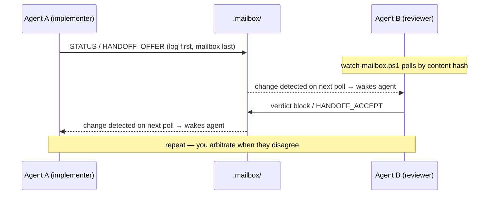

# cocopilot

**Run two GitHub Copilot CLI instances side by side — different models, one repo, working as peers.**

One agent implements while the other reviews and challenges. They coordinate through a tiny file-based mailbox, hand off ownership explicitly, and never edit the same tree at once. You stay the arbiter.

> No daemon. No state machine. No lock-in. Just a convention ([`COLLABORATION.md`](COLLABORATION.md)), five PowerShell scripts, and three role prompts — pointable at **any local Git repository on your Windows machine**.

---

## Why

Different models have different strengths. Instead of picking one:

- 🛠️ **One implements** — exactly one agent owns the working tree at a time.
- 🔍 **One reviews** — the peer inspects real diffs, runs read-only checks, and challenges assumptions *before* the work lands.
- 🤝 **Explicit handoffs** — ownership transfers by offer → verify → accept, never by timeout or accident.
- 🧑‍⚖️ **You arbitrate** — disagreements escalate to the human after a bounded number of rounds. By design, nothing here automates you away.

## Quick start

Three commands. Requirements: Windows PowerShell 5.1 or pwsh 7, Git, and the `copilot` CLI on PATH.

```powershell
# 1. Initialize the mailbox inside the repo you want to pair on
C:\Repos\cocopilot\scripts\init-mailbox.ps1 -RepoPath C:\Repos\your-project

# 2. Launch both agents (two terminal windows, paired on that repo)
C:\Repos\cocopilot\scripts\start-agents.ps1 -RepoPath C:\Repos\your-project

# 3. When you're done — remove cocopilot's mailbox footprint (not the agents' project changes)
C:\Repos\cocopilot\scripts\cleanup-mailbox.ps1 -RepoPath C:\Repos\your-project
```

That's it. Agent A starts as the implementer on `claude-sonnet-5`, Agent B reviews on `gpt-5.6-terra` (both overridable), and they coordinate through `.mailbox/` inside your target repo — git-ignored automatically, removed completely by cleanup.

> `-RepoPath` defaults to the current directory, so you can also just `cd` into the target project first.

## How it works



- **The mailbox is the only channel.** Three files inside the target repo, all git-ignored:

  | File | Purpose | Lifetime |
  |---|---|---|
  | `.mailbox/implementer.json` | Who owns the working tree (single source of truth) | Whole-file temp + rename (best-effort torn-write protection) |
  | `.mailbox/mailbox.md` | Current turn: status, offers, reviews | Overwritten each turn |
  | `.mailbox/session.log.md` | Complete session history | Append-only, survives everything except cleanup |

- **Nobody polls you.** Each agent runs `watch-mailbox.ps1` in the background while waiting; it blocks until the peer writes, then exits — which wakes the agent like any finished shell command. You never relay "check the mailbox" between windows.

- **Reviews close with a verdict block** — a fixed, greppable format (`VERDICT` / `WORK_UNIT` / `ROUND` / severity counts / findings), so review outcomes are countable and auditable, never buried in prose:

  ```text
  VERDICT: REVISE
  WORK_UNIT: fix-auth-retry
  ROUND: 2/3
  BLOCKING: 1
  IMPORTANT: 1
  OPTIONAL: 0
  FINDINGS:
  - [BLOCKING] src/auth.ps1:88 — retry loop swallows the timeout error — rethrow after final attempt
  - [IMPORTANT] src/auth.ps1:102 — retry count is a magic number — hoist to a named constant
  ```

- **Disagreement is bounded.** A `REVISE` at `ROUND: 3/3` stops both agents — they write the open options + consequences and wait for **you**. No veto by repetition, no infinite polish loops.

- **Fresh eyes on demand.** Before accepting risky work, render the read-only **verifier** role into a brand-new session: it sees only the repo, the diff, and the verify request — not the session narrative — so its verdict is genuinely independent.

## The roles

| Role | Prompt | Can write? | Job |
|---|---|---|---|
| **agent-a** | [`prompts/agent-a.md`](prompts/agent-a.md) | When owner | Starts as implementer |
| **agent-b** | [`prompts/agent-b.md`](prompts/agent-b.md) | When owner | Starts as reviewer, takes ownership via handoff |
| **verifier** | [`prompts/verifier.md`](prompts/verifier.md) | **Never** | One-shot fresh-eyes check of a finished work unit |

Every prompt is generic — a **session-context banner** (generated per run) injects what each role needs, so nothing ever hardcodes your repo. Peer-role banners get absolute paths plus ready-to-run watch/init/ownership commands; the verifier banner gets only paths — a read-only role is deliberately never handed a mutating command.

## Command reference

All five user-facing commands live in [`scripts/`](scripts), support `-RepoPath` (default: current directory), and run on **Windows PowerShell 5.1 and pwsh 7**. (`_common.ps1` is an internal helper, not a command.)

### `init-mailbox.ps1` — set up a target repo

```powershell
.\scripts\init-mailbox.ps1 -RepoPath C:\Repos\your-project
```

Creates the ownership record and turn scratchpad from the two tracked templates and generates the session log, all inside the target repo's `.mailbox/`. For a Git target not already ignoring `.mailbox/`, it appends the ignore rule **before** creating any mailbox state — so nothing committable ever exists unprotected, even if init is interrupted.

| Parameter | Default | Meaning |
|---|---|---|
| `-RepoPath` | current dir | Target repository |
| `-Owner` | `agent-a` | Which role starts as implementer |
| `-OwnerModel` | `unknown` | Informational label for the owner's model |
| `-Force` | off | Reset record + scratchpad. **The session log is preserved** (a reset entry is appended) |

Safe to re-run: existing files are left alone without `-Force`.

### `start-agents.ps1` — launch the pair

```powershell
.\scripts\start-agents.ps1 -RepoPath C:\Repos\your-project

# custom models / flags
.\scripts\start-agents.ps1 -RepoPath C:\Repos\your-project `
    -AgentAArgs @("--model","gpt-5.4") `
    -AgentBArgs @("--model","claude-sonnet-5")

# use your own $PROFILE shortcut functions instead
.\scripts\start-agents.ps1 -RepoPath C:\Repos\your-project `
    -AgentACommand copilot-sonnet -AgentAArgs @() `
    -AgentBCommand copilot-terra  -AgentBArgs @()
```

By default, opens two terminal windows, each running a literal `copilot` invocation (no profile magic required) with role prompt + banner injected via `-i`, working directory set to the target repo, and read access back to the cocopilot install via `--add-dir`.

| Parameter | Default | Meaning |
|---|---|---|
| `-AgentACommand` / `-AgentBCommand` | `copilot` | Executable or profile function per agent |
| `-AgentAArgs` | `@("--model","claude-sonnet-5","--effort","max","--context","long_context","--autopilot","--allow-all")` | Complete argument array before `-C/-n/-i`; supplying it **replaces** the entire default. Pass `@()` when a profile function supplies its own flags |
| `-AgentBArgs` | `@("--model","gpt-5.6-terra","--effort","max","--context","long_context","--autopilot","--allow-all")` | Same rules as `-AgentAArgs` |
| `-NameA` / `-NameB` | `cocopilot-agent-a/b` | Session names (make unique to pair several repos at once) |
| `-UseWindowsTerminal` | off | `wt.exe` tabs when available; falls back to normal console windows otherwise |
| `-ShellExe` | current host | Shell for the new windows (pwsh vs powershell matters for `$PROFILE`); `powershell_ise.exe` auto-falls back to `powershell.exe` |

### `watch-mailbox.ps1` — the listening half

```powershell
.\scripts\watch-mailbox.ps1 -RepoPath C:\Repos\your-project                     # wait indefinitely
.\scripts\watch-mailbox.ps1 -RepoPath C:\Repos\your-project -TimeoutSeconds 1800  # give up after 30 min
```

Blocks until `implementer.json` or `mailbox.md` changes (content hash, not mtime), then exits `0`. Agents run it in the background and get woken by its completion. Exits `1` on timeout. One-shot by design — re-arm after each wake. The session log is deliberately **not** watched (its entry always lands before the mailbox write it accompanies).

| Parameter | Default | Meaning |
|---|---|---|
| `-TimeoutSeconds` | `0` (forever) | Exit 1 after this much silence |
| `-PollIntervalSeconds` | `3` | Hash-check frequency |

### `render-prompt.ps1` — manual launch / add a role to an open session

```powershell
.\scripts\render-prompt.ps1 -Agent b -RepoPath C:\Repos\your-project        # paste into a copilot window
.\scripts\render-prompt.ps1 -Agent verifier -RepoPath C:\Repos\your-project  # paste into a NEW session
```

Prints one role's paste-ready prompt (banner + role file). The verifier's banner deliberately contains **no** mutating commands — a read-only role is never handed a loaded gun.

| Parameter | Values | Meaning |
|---|---|---|
| `-Agent` | `a` · `b` · `verifier` | Which role to render |

### `cleanup-mailbox.ps1` — leave no trace

```powershell
.\scripts\cleanup-mailbox.ps1 -RepoPath C:\Repos\your-project          # remove everything
.\scripts\cleanup-mailbox.ps1 -RepoPath C:\Repos\your-project -WhatIf  # preview first
```

Removes `.mailbox/` and exactly the `.gitignore` block init added (your own rules survive, CRLF or LF). Defensively un-tracks any `.mailbox/` paths that somehow reached the git index — staged only, never auto-committed. Supports `-WhatIf` / `-Confirm`.

## The protocol in 60 seconds

Full text: [`COLLABORATION.md`](COLLABORATION.md) — the binding agreement both agents read on startup.

1. **One implementer at a time.** The peer inspects, runs non-mutating checks, reviews actual diffs.
2. **Handoff = offer → verify → accept**, recorded in the mailbox with a monotonic epoch pinned to git HEAD. No timeout takeover — a vanished owner is *your* call.
3. **Every review closes with the verdict block.** `REVISE` is mandatory while any Blocking finding is open.
4. **Rounds are counted and capped** (`ROUND: n/3`). A `REVISE` at the cap stops further revisions — both agents hand you the open options and consequences; an unresolved material tradeoff can escalate to you even earlier.
5. **Every mailbox entry is logged first** to the append-only session log — the full history survives even a `-Force` re-init, and `grep '^VERDICT:'` reconstructs every review outcome of a session.
6. **Fresh-eyes verification** for risky/final work: a new session, read-only, sees only repo + diff + request. Skippable for trivial changes.
7. **Evidence beats identity.** Repository facts outrank confidence, verbosity, or persistence — for both models.

## Layout

```
README.md                     you are here
COLLABORATION.md              the operating agreement both agents follow
.gitignore                    keeps generated .mailbox state out of this repo
.mailbox/
  implementer.example.json    tracked template — ownership record
  mailbox.example.md          tracked template — turn scratchpad
prompts/
  agent-a.md · agent-b.md     the two peer roles (generic, banner-driven)
  verifier.md                 read-only fresh-eyes role
scripts/
  _common.ps1                 banner builder + Write-MailboxJson (whole-file
                               JSON writer, temp + rename)
  init-mailbox.ps1            create <RepoPath>/.mailbox/*
  start-agents.ps1            launch both copilot windows
  watch-mailbox.ps1           block until the peer writes
  render-prompt.ps1           print a role prompt for manual paste
  cleanup-mailbox.ps1         remove cocopilot's footprint from a target
tests/
  Cocopilot.Tests.ps1         Pester 5 suite (18 tests, both hosts)
```

The real `.mailbox/` state is created **inside each target repo** (git-ignored there); cocopilot's own repo only tracks the two `*.example.*` templates.

## Tests

18 black-box Pester 5 tests cover init (creation, idempotency, `-Force` log preservation), the watcher (child-process wake/no-wake), cleanup (exact block removal, CRLF + LF), all three prompt renders, and whole-file JSON replacement with temp-file cleanup.

**Prerequisite:** Pester 5 side-by-side per host — Windows PowerShell 5.1 ships inbox Pester 3.4 only:

```powershell
Install-Module Pester -MinimumVersion 5.0 -MaximumVersion 5.999 -Scope CurrentUser -Force -SkipPublisherCheck
```

Run fail-closed on both hosts (copy/paste as-is from the repo root):

```powershell
# single-quoted so the outer shell doesn't expand $-variables before they reach the child host
powershell.exe -NoProfile -Command '$ErrorActionPreference="Stop"; $p = Import-Module Pester -MinimumVersion 5.0 -MaximumVersion 5.999 -Force -PassThru; if ($p.Version.Major -ne 5) { throw "Pester 5 required" }; Invoke-Pester -Path tests -EnableExit'

pwsh -NoProfile -Command '$ErrorActionPreference="Stop"; $p = Import-Module Pester -MinimumVersion 5.0 -MaximumVersion 5.999 -Force -PassThru; if ($p.Version.Major -ne 5) { throw "Pester 5 required" }; Invoke-Pester -Path tests -EnableExit'
```

## FAQ

**Does this need my repo to be on GitHub?** No. Any local Git repository works; cocopilot's scripts never require or access a Git remote. (The Copilot CLI itself talks to its own service, as always.)

**Can I pair on several repos at once?** Yes — mailboxes are per-`-RepoPath`. Give each launch distinct `-NameA`/`-NameB` so session names don't collide.

**What if the two agents deadlock or an owner vanishes?** Review disagreements are bounded by the round cap — a `REVISE` at `3/3` forces both agents to stop and hand you the decision. A vanished *owner* is different: nothing takes over by timeout (deliberately), so a watcher may wait indefinitely — inspect the tree, decide ownership yourself, and if needed re-run init with `-Force` (history survives in the session log).

**Why PowerShell?** The Copilot CLI ships on Windows first-class; the scripts run identically on Windows PowerShell 5.1 and pwsh 7 (byte-identical mailbox writes on both — tested).

**What does cocopilot deliberately NOT do?** No state machine, no schema validation, no file locking, no timeout takeover, no daemon, no committed artifacts in your repos. Those solve *unattended* operation — that's [claudex](https://github.com/David-c0degeek/claudex) territory: a deterministic state-machine orchestrator for headless or live Claude Code + Codex runs. cocopilot is its lightweight sibling: interactive pairing with you as the arbiter.

---

*The protocol is a generalized port of the personal Claude Code + Codex `collaboration.md` operating agreement behind [claudex](https://github.com/David-c0degeek/claudex) — and this repo's current form was itself co-authored and adversarially reviewed by that exact pairing.*
