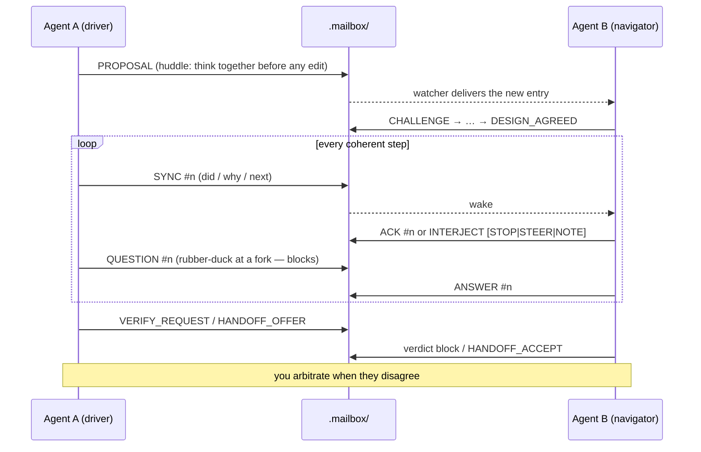

<p align="center">
  
</p>

**Run two GitHub Copilot CLI instances side by side — different models, one repo, working as peers.**

Two senior engineers at the same desk: they think together in a design huddle before any code is written, then one
drives while the other navigates — step-by-step syncs, live interjections, rubber-duck questions — through a tiny
file-based mailbox with one write-lane per agent. Ownership of the working tree transfers explicitly, and never do both
edit the tree at once. You stay the arbiter.

> No daemon. No state machine. No lock-in. Just a convention ([`COLLABORATION.md`](COLLABORATION.md)), a handful of
> PowerShell scripts, and three role prompts — pointable at **any local Git repository on your Windows machine**.

---

## Why

Different models have different strengths. Instead of picking one:

- 🧠 **They think together first** — a design huddle (`PROPOSAL` → `CHALLENGE` → `DESIGN_AGREED`) happens _before_ the
  first edit, so the wrong approach dies at design time, not in review round 2.
- 🛠️ **One drives** — exactly one agent owns the working tree at a time, narrating every coherent step as a `SYNC`.
- 🧭 **One navigates** — the peer rides along live: acknowledges or interjects on every step (`STOP`/`STEER`/`NOTE`),
  answers rubber-duck `QUESTION`s the driver blocks on, and still closes each work unit with a real review.
- 🤝 **Explicit handoffs** — ownership transfers by offer → verify → accept, never by timeout or accident.
- 🧑‍⚖️ **You arbitrate** — disagreements escalate to the human after a bounded number of rounds. By design, nothing here
  automates you away.

## Install

One line on a new machine:

```powershell
irm https://raw.githubusercontent.com/David-c0degeek/cocopilot/main/install.ps1 | iex

# or, if you already have (or prefer) a clone at a location of your choosing:
git clone https://github.com/David-c0degeek/cocopilot D:\repos\cocopilot; & D:\repos\cocopilot\install.ps1
```

The installer updates the clone (`git pull --ff-only`) and adds a tiny marker-guarded block to your pwsh profile that
dot-sources [`profile/cocopilot.profile.ps1`](profile/cocopilot.profile.ps1) — rerunning is idempotent, and future
updates need no profile edits. Run it from pwsh 7.4 or later. It refuses Windows PowerShell. If an earlier version
registered cocopilot in your Windows PowerShell profile, delete that `# >>> cocopilot >>>` block by hand. You get:

| Function                                                                           | Does                                                                                                                                                                                                                                        |
| ---------------------------------------------------------------------------------- | ------------------------------------------------------------------------------------------------------------------------------------------------------------------------------------------------------------------------------------------- |
| `cocopilot-start [-RepoPath] [-Name] [-AgentAModel] [-AgentBModel] […]`            | Inits the mailbox, lets you assign a model/settings to each role when omitted, and opens both named agent tabs. Defaults to the current directory.                                                                                          |
| `cocopilot-models [-Raw] [-NoFallback]`                                            | Shows the models available to your Copilot account plus supported effort/context settings and token limits.                                                                                                                                 |
| `cocopilot-prompt -Agent a\|b\|verifier [-RepoPath] [-ContextRoot] [-AllowNonGit]` | Copies that role's paste-ready (re)start prompt to the clipboard — for crashed windows, manual role adds, or a fresh verifier session. Roles `a` and `b` init a missing mailbox; `verifier` never does and needs a pinned `VERIFY_REQUEST`. |
| `cocopilot-cleanup [-RepoPath] [-Recurse] [-WhatIf]`                               | Removes cocopilot's `.mailbox\` files and ignore rule when you're done. `-Recurse` cleans every paired repo under `-RepoPath`.                                                                                                              |
| `cocopilot-update`                                                                 | `git pull` + re-register (reruns the installer).                                                                                                                                                                                            |
| `copilot-opus` / `copilot-sol` / `copilot-terra`                                   | Plain `copilot` launchers with cocopilot's default model/flags.                                                                                                                                                                             |

## Quick start

Requirements: PowerShell 7.4 or later (`pwsh`), Git, and the `copilot` CLI on PATH. Windows PowerShell 5.1 is not
supported. Use a currently supported PowerShell release: 7.4 LTS support ends on 10 November 2026.

```powershell
# Starts from the current repo, creates its mailbox if needed, and opens the
# model picker for Agent A and Agent B.
cd C:\Repos\your-project
cocopilot-start -Name "12313 polis"

# When finished:
cocopilot-cleanup

# Or skip the picker with explicit role assignments:
cocopilot-start -Name "12313 polis" `
    -AgentAModel claude-opus-5.5 -AgentAEffort max -AgentAContext long_context `
    -AgentBModel gpt-6.1-sol    -AgentBEffort max -AgentBContext long_context
```

The two tabs and Copilot sessions are named **`12313 polis - agent a`** and **`12313 polis - agent b`**. Agent A still
starts as the driver and Agent B as the navigator. The picker only decides which model and settings get each fixed lane
identity. Pressing Enter through the picker keeps the suggested pairing when those models are available:
`claude-opus-5.5` for Agent A and `gpt-6.1-sol` for Agent B. The picker preselects each model's strongest supported
effort (ranked `max` > `xhigh` > `high` > `medium` > `low` > `minimal` > `none`) and long context where available.

> `-RepoPath` defaults to the current directory, so you can also just `cd` into the target project first.

## How it works


```mermaid
sequenceDiagram
    participant A as Agent A (driver)
    participant M as .mailbox/
    participant B as Agent B (navigator)
    A->>M: PROPOSAL (huddle: think together before any edit)
    M-->>B: watcher delivers the new entry
    B->>M: CHALLENGE → … → DESIGN_AGREED
    loop every coherent step
        A->>M: SYNC #35;n (did / why / next)
        M-->>B: wake
        B->>M: ACK #35;n or INTERJECT [STOP|STEER|NOTE]
        A->>M: QUESTION #35;n (rubber-duck at a fork — blocks)
        B->>M: ANSWER #35;n
    end
    A->>M: VERIFY_REQUEST / HANDOFF_OFFER
    B->>M: verdict block / HANDOFF_ACCEPT
    Note over A,B: you arbitrate when they disagree
```

- **The mailbox is the only channel.** A few files inside the target repo, git-ignored through `.git/info/exclude`
  (never your `.gitignore`) — and each agent writes **only its own lane**, so both can post at the same moment without
  ever clobbering each other:

  | File                          | Purpose                                                         | Lifetime                                                           |
  | ----------------------------- | --------------------------------------------------------------- | ------------------------------------------------------------------ |
  | `.mailbox/implementer.json`   | Who owns the working tree (single source of truth)              | Replaced whole by `handoff.ps1` under a lock; never seen partial   |
  | `.mailbox/agent-a.md`         | Agent A's lane: thinking, syncs, offers, reviews                | Overwritten on each of A's turns; written only by A                |
  | `.mailbox/agent-b.md`         | Agent B's lane: same, for B                                     | Overwritten on each of B's turns; written only by B                |
  | `.mailbox/session.log.md`     | Complete merged session history — and each agent's inbox        | Append-only, each entry closed by an end marker; survives `-Force` |
  | `.mailbox/agent-a.cursor`     | How far agent A has acknowledged the log (and `agent-b.cursor`) | Moved only by that agent's acknowledged watch                      |
  | `.mailbox/verify-request.md`  | The pinned `VERIFY_REQUEST` the fresh-eyes verifier reads       | Replaced by the next pinned request                                |
  | `.mailbox/baseline-<id>.json` | Snapshot of the target when the current ownership began         | Immutable; replaced by the next handoff                            |

- **Nobody polls you, and nothing gets lost.** Each agent runs `watch-mailbox.ps1 -Role <its-role>` in the background
  while blocked on the peer. It delivers every peer entry the agent hasn't acknowledged yet — at once if some are
  waiting — and otherwise exits on the next one or on any ownership change, which wakes the agent like any finished
  shell command. Entries posted while an agent is busy wait in the log for its next watch. You never relay "check the
  mailbox" between windows.

- **Collaboration is continuous, not post-hoc.** The huddle happens before the first edit; during implementation the
  driver syncs at every commitment point and the navigator answers every sync — so by the time the formal review
  arrives, the disagreements have usually already been settled in small, cheap pieces.

- **Reviews close with a verdict block** — a fixed, greppable format (`VERDICT` / `WORK_UNIT` / `ROUND` / severity
  counts / findings), so review outcomes are countable and auditable, never buried in prose:

  ```text
  VERDICT: REVISE
  WORK_UNIT: fix-auth-retry
  ROUND: 2/3
  BLOCKING: 1
  IMPORTANT: 1
  OPTIONAL: 0
  FINDINGS:
  - [BLOCKING] src/auth.ps1:88 — retry loop swallows the timeout error — rethrow after final attempt
  - [IMPORTANT] src/auth.ps1:102 — retry count is a magic number — hoist to a named constant
  ```

- **Disagreement is bounded.** A `REVISE` at `ROUND: 3/3` stops both agents — they write the open options + consequences
  and wait for **you**. No veto by repetition, no infinite polish loops.

- **Fresh eyes on demand.** Before accepting risky work, render the read-only **verifier** role into a brand-new
  session: it sees only the repo, the diff, and the verify request — not the session narrative — so its verdict is
  genuinely independent.

## The roles

| Role         | Prompt                                             | Can write? | Job                                               |
| ------------ | -------------------------------------------------- | ---------- | ------------------------------------------------- |
| **agent-a**  | [`prompts/agent.md`](prompts/agent.md), as agent-a | When owner | Starts as implementer                             |
| **agent-b**  | [`prompts/agent.md`](prompts/agent.md), as agent-b | When owner | Starts as reviewer, takes ownership via handoff   |
| **verifier** | [`prompts/verifier.md`](prompts/verifier.md)       | **Never**  | One-shot fresh-eyes check of a finished work unit |

Every prompt is generic — a **session-context banner** (generated per run) injects what each role needs, so nothing ever
hardcodes your repo. Both peer roles render from one shared template, so their instructions differ only in the role
names. Peer-role banners get absolute paths plus ready-to-run watch/init/ownership commands; the verifier banner gets
only paths — a read-only role is deliberately never handed a mutating command.

## Command reference

All user-facing scripts live in [`scripts/`](scripts) and require **PowerShell 7.4 or later** (`pwsh`).
Repository-oriented commands take `-RepoPath` (default: current directory, except `write-lane.ps1` and `handoff.ps1`,
which require it explicitly); `list-models.ps1` is account-oriented and needs no repository. Files prefixed with `_` are
internal helpers, not commands.

### `init-mailbox.ps1` — set up a target repo

```powershell
.\scripts\init-mailbox.ps1 -RepoPath C:\Repos\your-project
```

Creates the ownership record and both per-agent lane scratchpads from the two tracked templates, generates the session
log, and records one delivery cursor per agent and a handoff baseline, all inside the target repo's `.mailbox/`. For a
Git target not already ignoring `.mailbox/`, it adds a managed rule to the repository's `.git/info/exclude` **before**
creating any mailbox state. Nothing committable ever exists unprotected, even if init is interrupted. Your tracked
`.gitignore` is never edited, so `git stash` or `git checkout` can't un-ignore the mailbox.

Refuses before changing anything when `-RepoPath` is a cocopilot install: its own path, or any alias or copy whose
`.mailbox/` holds the two `*.example.*` templates this script reads from. It also refuses when git tracks anything under
`.mailbox/`, and when an existing `.mailbox/` holds anything cocopilot didn't create.

| Parameter             | Default     | Meaning                                                                                                                                                                                                                                                                                                                                                                                                                                                                                                    |
| --------------------- | ----------- | ---------------------------------------------------------------------------------------------------------------------------------------------------------------------------------------------------------------------------------------------------------------------------------------------------------------------------------------------------------------------------------------------------------------------------------------------------------------------------------------------------------- |
| `-RepoPath`           | current dir | Target repository                                                                                                                                                                                                                                                                                                                                                                                                                                                                                          |
| `-Owner`              | `agent-a`   | Which role starts as implementer: `agent-a` or `agent-b`                                                                                                                                                                                                                                                                                                                                                                                                                                                   |
| `-OwnerModel`         | `unknown`   | Informational label for the owner's model                                                                                                                                                                                                                                                                                                                                                                                                                                                                  |
| `-Force`              | off         | Reset record + lanes; the epoch rises by one and the handoff baseline is kept. **The session log is preserved** (a reset entry is appended)                                                                                                                                                                                                                                                                                                                                                                |
| `-AcknowledgeHistory` | off         | Count everything so far as handled: both delivery cursors move to the log's current end (also a cursor that exists), and the current state becomes the handoff baseline (replacing an existing one). Refused while a handoff offer is open, unless combined with `-Force`. Use it only when every entry so far is handled, with no STOP or QUESTION still pending                                                                                                                                          |
| `-AllowNonGit`        | off         | Pair directly on a workspace root that isn't itself a git repo (e.g. `C:\Repos` containing several independent repos as children) — `head` then reads the fixed sentinel `non-git-root`, and handoffs compare every git worktree below the root plus every other file (see `COLLABORATION.md` "Ownership handoff" → "Non-git workspace roots"). If you only need read-only cross-repo context while writing to just ONE child repo, `-ContextRoot` on `start-agents.ps1` is the lighter-weight alternative |

Safe to re-run: existing files are left alone without `-Force`, and a missing lane, record or log is recreated. Delivery
cursors and the handoff baseline are taken from the current state only for a new mailbox or with `-AcknowledgeHistory`.
Re-running, `-Force` and a recreated record never count existing history as handled on their own:

- A missing cursor stays missing, so the first watch of that agent replays the whole log.
- `-Force` keeps the baseline of the record it replaces.
- A record without a baseline, also a recreated one, keeps none, so handoffs stay refused.

Upgrading a mailbox from an older cocopilot is therefore an explicit step: stop both agents, then run init with
`-AcknowledgeHistory`, only when every entry so far is handled. Nothing in cocopilot passes that switch for you.
`start-agents.ps1` and `cocopilot-start` warn about a missing cursor and start both agents.

### `list-models.ps1` — inspect available models and settings

```powershell
# Installed profile command
cocopilot-models

# Direct script equivalent
.\scripts\list-models.ps1
```

Shows the current account's enabled models with supported reasoning effort levels, `default`/`long_context` token
limits, maximum output size, capability category, and price category. The launcher uses this same catalog for its
numbered Agent A/Agent B picker, so unsupported effort/context combinations are rejected before tabs are opened.

Account-aware discovery uses the SDK bundled with the installed Copilot CLI when Node.js is on PATH. If that optional
path is unavailable, the command warns and falls back to model IDs advertised by `copilot completion bash`; account
availability and per-model settings are then shown as `unknown`, and Copilot itself remains the final validator.
`-NoFallback` makes exact account discovery mandatory, while `-Raw` returns reusable descriptor objects instead of a
table. Node.js is not required when models are supplied explicitly and is not required to launch the agents. Discovery
always uses the first `copilot` native executable or PowerShell script on PATH — never a same-name alias or profile
function, and never a cmd shim (`.cmd`/`.bat`), which is skipped with a warning — and stops with an error when there is
none.

### `start-agents.ps1` — launch the pair

```powershell
# interactive model/settings assignment for both roles
.\scripts\start-agents.ps1 -RepoPath C:\Repos\your-project

# explicit role assignment (no picker)
.\scripts\start-agents.ps1 -RepoPath C:\Repos\your-project `
    -Name "12313 polis" `
    -AgentAModel gpt-5.4         -AgentAEffort xhigh -AgentAContext long_context `
    -AgentBModel claude-opus-5.5 -AgentBEffort max   -AgentBContext long_context

# expert escape hatch: profile functions supply every model/setting flag
.\scripts\start-agents.ps1 -RepoPath C:\Repos\your-project `
    -AgentACommand copilot-opus -AgentAArgs @() `
    -AgentBCommand copilot-sol  -AgentBArgs @()
```

When a role has no `-Agent*Model` and no explicitly-bound raw `-Agent*Args`, the launcher shows the shared model catalog
once, then asks for that role's model and only the settings that model supports. A supplied model skips the picker for
that role; omitted effort/context values then use the Copilot CLI's model defaults. The selected mapping is printed
before launch, making it explicit which model is Agent A and which is Agent B.

Each tab runs the first `copilot` native executable or PowerShell script on PATH by its full path, so a same-name alias
or profile function cannot replace it. A cmd shim (`.cmd`/`.bat`) cannot carry the multi-line prompt, so it is skipped
with a warning. If no usable `copilot` is on PATH, the launcher stops before model discovery or opening any window.
Each new tab renders its own role prompt + banner with `render-prompt.ps1` and passes it via `-i`, so the launch command
itself stays small even with long paths. PowerShell's execution policy in a new pwsh session must therefore allow
cocopilot's scripts, as it already must for the installed profile functions. The rendered prompt still reaches
`copilot` as one command-line argument, which Windows limits to 32,767 characters. With 220-character paths the prompt
is about 13,900 characters, so only a much larger template or banner would reach that limit. The working directory is
the target repo, with read access back to the cocopilot install via `--add-dir`. Whenever `wt.exe` (Windows Terminal)
is on PATH, both agents open as tabs in the most-recently-used wt.exe window — typically the very window you ran this
from — instead of separate OS windows; pass `-UseWindowsTerminal:$false` to force plain console windows regardless.

| Parameter                           | Default                                                            | Meaning                                                                                                                                                                                                                                   |
| ----------------------------------- | ------------------------------------------------------------------ | ----------------------------------------------------------------------------------------------------------------------------------------------------------------------------------------------------------------------------------------- |
| `-ContextRoot`                      | (none)                                                             | Workspace folder (e.g. a parent dir of many repos) granted as a **read-only search scope** via an extra `--add-dir` + banner note — cross-repo context without widening ownership or writes                                               |
| `-AgentACommand` / `-AgentBCommand` | `copilot` on PATH, by full path                                    | Command per agent. An explicit value, such as a profile shortcut function, is launched as given                                                                                                                                           |
| `-AgentAModel` / `-AgentBModel`     | picker (`claude-opus-5.5` / `gpt-6.1-sol` suggested)               | Model assigned to that fixed lane identity. Supplying one skips that role's model picker                                                                                                                                                  |
| `-AgentAEffort` / `-AgentBEffort`   | picker: strongest supported; explicit model: CLI default           | `none` · `minimal` · `low` · `medium` · `high` · `xhigh` · `max`; the account-aware picker offers only levels supported by the selected model                                                                                             |
| `-AgentAContext` / `-AgentBContext` | picker: `long_context` when supported; explicit model: CLI default | `default` · `long_context`; account-aware selection rejects a tier the model does not support                                                                                                                                             |
| `-AgentAArgs` / `-AgentBArgs`       | not bound                                                          | Expert complete argument array before `-C/-n/-i`. Explicitly binding it suppresses all typed model settings and the picker for that role; pass `@()` when a profile function supplies its own flags                                       |
| `-NameA` / `-NameB`                 | `cocopilot-agent-a/b`                                              | Session names, and each new window/tab's title. An explicit value always wins; otherwise derived from `-SessionName`                                                                                                                      |
| `-SessionName` / `-Name`            | (none)                                                             | Shared name for both tabs and Copilot sessions — e.g. `-Name "12313 polis"` yields `12313 polis - agent a` / `12313 polis - agent b`                                                                                                      |
| `-UseWindowsTerminal`               | `$true`                                                            | `wt.exe` tabs whenever available (silently falls back to plain console windows otherwise — a no-op default for anyone without Windows Terminal); pass `-UseWindowsTerminal:$false` to force plain windows even when `wt.exe` is installed |
| `-ShellExe`                         | current pwsh                                                       | pwsh executable for the new windows, which load its `$PROFILE`. Windows PowerShell (`powershell.exe`, `powershell_ise.exe`) is rejected, and each window re-checks for PowerShell 7.4+ before it starts `copilot`                         |

### `watch-mailbox.ps1` — the listening half

```powershell
.\scripts\watch-mailbox.ps1 -RepoPath C:\Repos\your-project -Role agent-a          # deliver agent-b's new entries
.\scripts\watch-mailbox.ps1 -RepoPath C:\Repos\your-project -TimeoutSeconds 1800   # observe all, give up after 30 min
```

With `-Role`, the session log is the inbox. The watcher delivers every entry the **peer** wrote after this agent's
cursor — at once, so an entry posted while the agent was busy is never missed — and otherwise waits for the next peer
entry or for any change to `implementer.json`, including the agent's own handoff update. Each entry is shown with its
heading and its body indented by four spaces. The output ends with an `ACK_TOKEN` and a ready-made `RE_ARM:` command;
running it after handling the entries acknowledges them and watches again. Without that acknowledgement the same entries
are delivered again. Entries it cannot prove complete carry a label: `LEGACY` (older than end markers), `INCOMPLETE` (no
end marker) or `FRAGMENT`. A missing cursor delivers the whole log from its start. Without `-Role`, the watcher observes
`implementer.json` and both lanes instead (for you, or any outside observer). Exits `0` with something to act on and `1`
on timeout.

| Parameter              | Default       | Meaning                                                                      |
| ---------------------- | ------------- | ---------------------------------------------------------------------------- |
| `-Role`                | (none)        | `agent-a` · `agent-b` — deliver the other agent's entries, move this cursor  |
| `-Ack`                 | (none)        | The `ACK_TOKEN` of the delivery you handled; refused unless it ends an entry |
| `-TimeoutSeconds`      | `0` (forever) | Exit 1 after this much silence                                               |
| `-PollIntervalSeconds` | `3`           | Check frequency, from 1 to 3600 seconds                                      |

### `write-lane.ps1` — post one lane entry

```powershell
.\scripts\write-lane.ps1 -RepoPath C:\Repos\your-project -Role agent-a -Turn $turn
```

The preferred way to post a THINKING/PROPOSAL/SYNC/ACK/etc. entry: appends it to `session.log.md` **first**, then
overwrites your own lane (`agent-a.md`/`agent-b.md`) **last** — the exact order the protocol requires — framing the log
entry with the UTC `## <timestamp> <role>` heading and a closing end marker, and preserving `-Turn`'s content exactly
in the lane (no forced trailing newline). It refuses a `-Turn` line that a reader could take for a heading or an end
marker, before writing anything. `-Role` determines both destination paths from a value already baked in by your own
session banner, so running the given command verbatim removes hand-typed-path mistakes (`agent-a.md` vs. `agent-b.md`)
— it does **not** authenticate the caller: `-Role` accepts either valid value, so a wrong-but-valid `-Role` is not
itself an error (see COLLABORATION.md's identity-vs-responsibility guidance for the discipline that prevents that). The
log append runs under an exclusive handle and retries only a genuine sharing violation; a failure on the lane overwrite
never re-appends the log entry.

| Parameter        | Default      | Meaning                                                                                                                 |
| ---------------- | ------------ | ----------------------------------------------------------------------------------------------------------------------- |
| `-RepoPath`      | _(required)_ | Unlike most other commands, no current-directory default — normally invoked with the exact path from the session banner |
| `-Role`          | _(required)_ | `agent-a` · `agent-b` — which lane to write                                                                             |
| `-Turn`          | _(required)_ | Raw entry body — no timestamp or `## ...` heading, generated internally                                                 |
| `-VerifyRequest` | off          | Also pin this `VERIFY_REQUEST` to `.mailbox/verify-request.md` for the fresh-eyes verifier (active implementer only)    |

### `handoff.ps1` — change ownership

```powershell
.\scripts\handoff.ps1 -RepoPath C:\Repos\your-project -Role agent-a -Action Offer
.\scripts\handoff.ps1 -RepoPath C:\Repos\your-project -Role agent-b -Action Accept -Epoch 3 -OwnerModel gpt-6.1-sol
```

The only supported way to change `implementer.json`. Each action takes the ownership lock, checks that it fits the
record's current state, changes the whole record, and prints the entry to post in your lane; a refused action changes
nothing. `Offer` computes the dirty manifest — every difference from the baseline taken when the current ownership
began, including inside nested repositories and submodules — so nobody writes it by hand. `Accept` recomputes HEAD and
the manifest and refuses on any difference, then records a fresh baseline at the next epoch. `Cancel` withdraws an
offer for good, and `SetModel` records the owner's model. Offer and Accept refuse while the state can only be partly
captured (over 20,000 changed or unversioned files or 512 MB to hash).

| Parameter     | Default      | Meaning                                                                                    |
| ------------- | ------------ | ------------------------------------------------------------------------------------------ |
| `-RepoPath`   | _(required)_ | Target repository or workspace root                                                        |
| `-Role`       | _(required)_ | Your own lane identity: `agent-a` · `agent-b`                                              |
| `-Action`     | _(required)_ | `Offer` · `Accept` · `Cancel` · `SetModel`                                                 |
| `-Epoch`      | (none)       | The offer's epoch — required for `Accept` and `Cancel`                                     |
| `-OwnerModel` | (none)       | The model you run — required for `SetModel`; recorded by `Accept` (`unknown` when omitted) |

### `render-prompt.ps1` — manual launch / add a role to an open session

```powershell
.\scripts\render-prompt.ps1 -Agent b -RepoPath C:\Repos\your-project        # paste into a copilot window
.\scripts\render-prompt.ps1 -Agent verifier -RepoPath C:\Repos\your-project  # paste into a NEW session
```

Prints one role's paste-ready prompt: the banner plus the role prompt (both peer roles render from `prompts/agent.md`).
The verifier's banner deliberately contains **no** mutating commands — a read-only role is never handed a loaded gun.

| Parameter      | Values                 | Meaning                                                                                                                              |
| -------------- | ---------------------- | ------------------------------------------------------------------------------------------------------------------------------------ |
| `-Agent`       | `a` · `b` · `verifier` | Which role to render                                                                                                                 |
| `-ContextRoot` | (none)                 | Same read-only workspace scope as `start-agents.ps1` — when pasting manually, also launch that window with `--add-dir <ContextRoot>` |

### `cleanup-mailbox.ps1` — leave no trace

```powershell
.\scripts\cleanup-mailbox.ps1 -RepoPath C:\Repos\your-project          # remove everything
.\scripts\cleanup-mailbox.ps1 -RepoPath C:\Repos\your-project -WhatIf  # preview first
.\scripts\cleanup-mailbox.ps1 -RepoPath C:\Repos -Recurse              # clean every paired repo under C:\Repos
```

Deletes only the files cocopilot created in `.mailbox/`. The directory goes only when it is then empty; anything else
stays and is reported. It also removes cocopilot's managed rule from `.git/info/exclude`, and the `.gitignore` block
that older versions added. Your own rules and the file's encoding survive, CRLF or LF. Before changing anything, it
refuses a cocopilot install (by path or templates), tracked content under `.mailbox/`, a linked `.mailbox/`, and any
`.mailbox/` that isn't a cocopilot mailbox (no valid ownership record or no cocopilot log marker). Supports `-WhatIf` /
`-Confirm`.

| Parameter   | Default     | Meaning                                                                                                                     |
| ----------- | ----------- | --------------------------------------------------------------------------------------------------------------------------- |
| `-RepoPath` | current dir | Repository to clean up, or — with `-Recurse` — the root to search                                                           |
| `-Recurse`  | off         | Treat `-RepoPath` as a search root: find and clean up every cocopilot mailbox at or below it (including `-RepoPath` itself) |

With `-Recurse`, the walk never descends into a directory named `.git` or `node_modules`, and never follows a reparse
point (symbolic link, junction, or mount point) — so a junction can't create a traversal cycle back up the tree or walk
the search outside the requested root. A `.mailbox/` that is itself a reparse point is rejected the same way, in both
`-Recurse` discovery and the single-target path — cocopilot never creates it that way, and `-Recurse -Force` must never
be pointed through a link to an arbitrary, externally-controlled target. A cocopilot install, found by path or by its
templates, is reported as a discovery issue, never attempted as a target. A `.mailbox/` that isn't cocopilot's is
skipped and listed in the summary, never touched. A directory that can't be enumerated is recorded as a discovery issue
rather than silently skipped. One target failing never stops the others — every discoverable target is attempted, a
summary is printed, and the script throws only after every attempt has completed if anything (cleanup or discovery)
failed, so a partial cleanup can't be mistaken for full success.

## The protocol in 60 seconds

Full text: [`COLLABORATION.md`](COLLABORATION.md) — the binding agreement both agents read on startup.

1. **Think together before editing.** Non-trivial work opens with a design huddle — `PROPOSAL` → `CHALLENGE` →
   `DESIGN_AGREED`, capped at 3 rounds — and no tracked file changes before it closes (trivial work may log an explicit
   skip, which the peer can veto).
2. **One implementer at a time.** The driver narrates every coherent step (`SYNC #n`); the navigator answers each one
   (`ACK` or `INTERJECT [STOP|STEER|NOTE]`), inspects real diffs, and answers rubber-duck `QUESTION`s the driver blocks
   on.
3. **One lane per agent.** Each agent writes only its own mailbox lane — simultaneous posting can't clobber anything.
4. **Handoff = offer → verify → accept** through `handoff.ps1`, recorded with a monotonic epoch. The offer's dirty
   manifest is computed against a baseline and re-proven on accept. No timeout takeover — a vanished owner is _your_
   call.
5. **Every review closes with the verdict block.** `REVISE` is mandatory while any Blocking finding is open.
6. **Rounds are counted and capped** (`ROUND: n/3`). A `REVISE` at the cap stops further revisions — both agents hand
   you the open options and consequences; an unresolved material tradeoff can escalate to you even earlier.
7. **Every lane entry is logged first** to the append-only session log — the full history survives even a `-Force`
   re-init. `grep '^VERDICT:'` lists the candidate verdict lines of a session, not a count of reviews: a verdict quoted
   or transcribed inside another entry matches too, so read each match before you count.
8. **Fresh-eyes verification** for risky/final work: a new session, read-only, sees only repo + diff + request.
   Skippable for trivial changes.
9. **Evidence beats identity.** Repository facts outrank confidence, verbosity, or persistence — for both models.

## Layout

```
README.md                     you are here
COLLABORATION.md              the operating agreement both agents follow
install.ps1                   one-line install/update + profile registration
.gitignore                    keeps generated .mailbox state out of this repo
assets/
  cocopilot.png               the logo
profile/
  cocopilot.profile.ps1       the functions install.ps1 dot-sources into
                               your profile (cocopilot-start/-models/…)
.mailbox/
  implementer.example.json    tracked template — ownership record
  lane.example.md             tracked template — per-agent lane scratchpad
prompts/
  agent.md                    shared template for both peer roles
                               (rendered per role, banner-driven)
  verifier.md                 read-only fresh-eyes role
scripts/
  _common.ps1                 banner + role-prompt rendering, mailbox I/O
                               (atomic replace, framed log entries, cursors,
                               ownership lock, handoff baselines)
  _models.ps1                 account model discovery, picker, argument helpers
  init-mailbox.ps1            create <RepoPath>/.mailbox/*
  list-models.ps1             show available models + supported settings
  start-agents.ps1            launch both copilot windows
  watch-mailbox.ps1           deliver the peer's new log entries
  write-lane.ps1              post one lane entry (log first, lane last)
  handoff.ps1                 offer / accept / cancel ownership, record model
  render-prompt.ps1           print a role prompt for manual paste
  cleanup-mailbox.ps1         remove cocopilot's footprint from a target
tests/
  Cocopilot.Tests.ps1         Pester 5 suite (215 tests, pwsh 7.4+)
```

The real `.mailbox/` state is created **inside each target repo** (git-ignored there); cocopilot's own repo only tracks
the two `*.example.*` templates.

## Tests

215 black-box Pester 5 tests cover init, git-local ignore rules (including non-ASCII paths under an OEM console code
page), watcher wake/no-wake behavior, lossless log delivery
(cursors, acknowledgement tokens, redelivery, labelled legacy and incomplete entries, multi-byte offsets), framed and
exclusive log appends under concurrent writers and readers, whole-file replacement that concurrent readers never see
missing or partial, culture-independent timestamps, the pinned `VERIFY_REQUEST`, ownership handoffs (computed
manifests including nested repositories, baselines kept across `-Force` and replaced only by `-AcknowledgeHistory`,
epochs, the ownership lock, concurrent accepts, partial-capture refusal), own-lane writes and append-only logging, safe
cleanup (single and recursive, foreign-mailbox and cocopilot-install protection), shared role-template rendering for
every role, non-git workspace recovery,
unacknowledged history that no launch, mailbox repair or re-run of init skips (a pending peer STOP is still delivered;
only `-AcknowledgeHistory` counts history as handled), the launch-time warning for a mailbox without delivery cursors,
session-name/window-title helpers, Windows Terminal command-line quoting, the PowerShell 7.4 requirement and native
launch-argument passing, bounded launch commands with in-window prompt rendering, stock Copilot CLI resolution by path
(never a profile function), npm-installed Copilot resolution, model catalog parsing and capability mapping, numbered
model selection with the strongest-effort default, supported effort/context validation, independent Agent A/Agent B
argument generation, the profile/installer command surface (including empty profiles and the read-only verifier
prompt), and `Get-Help` for every user-facing script.

**Prerequisite:** Pester 5 for pwsh. pwsh can also see the inbox Pester 3.4 from Windows PowerShell, which is too old:

```powershell
Install-Module Pester -MinimumVersion 5.0 -MaximumVersion 5.999 -Scope CurrentUser -Force -SkipPublisherCheck
```

Run fail-closed from the repo root (copy/paste as-is):

```powershell
# single-quoted so the outer shell doesn't expand $-variables before they reach the child host
pwsh -NoProfile -Command '$ErrorActionPreference="Stop"; $p = Import-Module Pester -MinimumVersion 5.0 -MaximumVersion 5.999 -Force -PassThru; if ($p.Version.Major -ne 5) { throw "Pester 5 required" }; $c = New-PesterConfiguration; $c.Run.Path = "tests"; $c.Run.Exit = $true; Invoke-Pester -Configuration $c'
```

For quick feedback while you work, run the fast subset. It runs the 112 tests without the `Slow` tag and skips the
other 103 tests. It never replaces the full run above, which stays the check before any commit.

```powershell
# the full-run command plus one filter line
pwsh -NoProfile -Command '$ErrorActionPreference="Stop"; $p = Import-Module Pester -MinimumVersion 5.0 -MaximumVersion 5.999 -Force -PassThru; if ($p.Version.Major -ne 5) { throw "Pester 5 required" }; $c = New-PesterConfiguration; $c.Run.Path = "tests"; $c.Run.Exit = $true; $c.Filter.ExcludeTag = "Slow"; Invoke-Pester -Configuration $c'
```

Give a test `-Tag Slow` when it starts a process or a job, runs the watcher or really sleeps, or when one of its cases
took 1 second or more in a serial full run. Durations change with machine load, so a test that was slow in one of the
observed runs keeps the tag.

## FAQ

**Does this need my repo to be on GitHub?** No. Any local Git repository works; cocopilot's scripts never require or
access a Git remote. (The Copilot CLI itself talks to its own service, as always.)

**Can I pair on several repos at once?** Yes — mailboxes are per-`-RepoPath`. Give each launch a distinct
`-Name`/`-SessionName` (or `-NameA`/`-NameB` directly) so window/tab titles and session names don't collide.

**Can I point one pair directly at a whole workspace of repos (`C:\Repos`) instead of one child repo?** Yes — pass
`-AllowNonGit` to `init-mailbox.ps1` (or `cocopilot-start`) to pair directly on a workspace root that isn't itself a git
repository, so a single pair can cover a work unit spanning several child repos at once. Ownership then anchors to the
dirty manifest instead of git HEAD/status: `head` reads the fixed sentinel `non-git-root`, and `handoff.ps1` compares
every git worktree below the root (its HEAD, staged changes, and each changed or untracked path) plus every other file
(size and content hash) with the baseline — see `COLLABORATION.md` "Ownership handoff" → "Non-git workspace roots". If
you only need read-only cross-repo context while writing to just ONE child repo — or the work is genuinely independent
per repo rather than one coordinated unit — `-ContextRoot` is the lighter-weight alternative: pair on that one repo
(`cocopilot-start -RepoPath C:\Repos\claim -ContextRoot C:\Repos`) and both agents can still search every sibling repo
for context, while ownership, diffs, and writes stay anchored to the one target; reserve one-pair-per-repo for genuinely
independent work units, each with the same `-ContextRoot`.

**What if the two agents deadlock or an owner vanishes?** Review disagreements are bounded by the round cap — a `REVISE`
at `3/3` forces both agents to stop and hand you the decision. A vanished _owner_ is different: nothing takes over by
timeout (deliberately), so a watcher may wait indefinitely — inspect the tree, decide ownership yourself, and if needed
re-run init with `-Force` (history survives in the session log).

**Why PowerShell?** The Copilot CLI ships on Windows first-class. cocopilot requires PowerShell 7.4 or later (`pwsh`).
Windows PowerShell 5.1 splits the long launch prompt at its embedded quotes before `copilot` receives it.

**What does cocopilot deliberately NOT do?** No state machine driving the agents, no daemon, no timeout takeover, no
unattended orchestration, no committed artifacts in your repos. The only lock is the short one around each ownership
update. Unattended operation is [claudex](https://github.com/David-c0degeek/claudex) territory: a deterministic
state-machine orchestrator for headless or live Claude Code + Codex runs. cocopilot is its lightweight sibling:
interactive pairing with you as the arbiter.

---

_The protocol is a generalized port of the personal Claude Code + Codex `collaboration.md` operating agreement behind
[claudex](https://github.com/David-c0degeek/claudex) — and this repo's current form was itself co-authored and
adversarially reviewed by that exact pairing._
